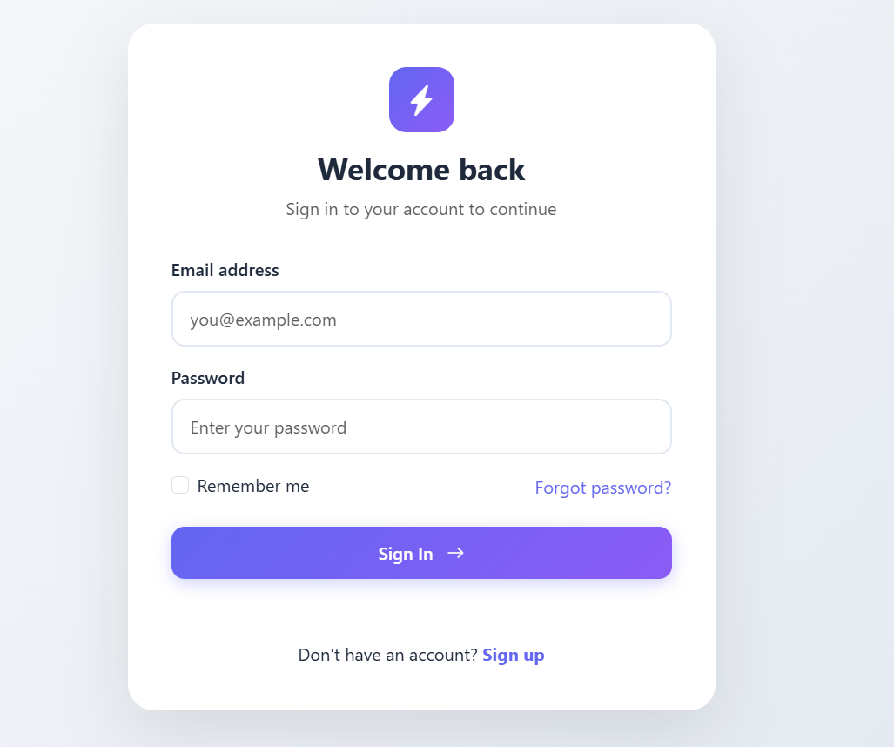
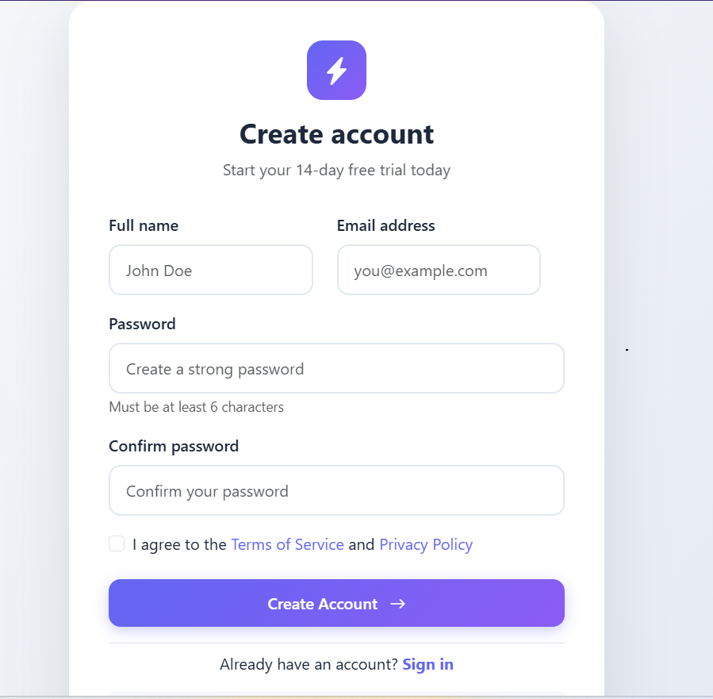
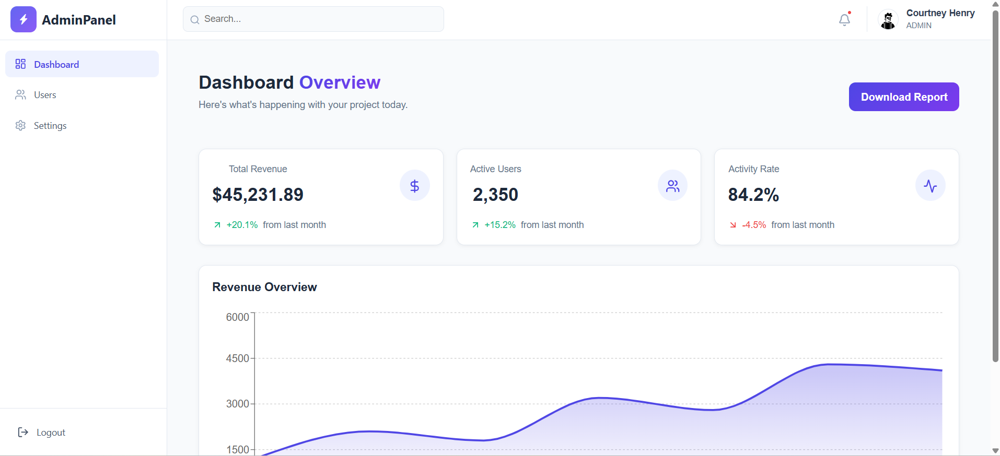

🛡️ SecureStack: Full-Stack JWT Authentication System
Spring Boot
React
Spring Security
License

SecureStack is a production-ready authentication boilerplate. It demonstrates a robust implementation of JSON Web Tokens (JWT) for stateless session management, featuring a decoupled architecture with a Spring Boot 3 REST API and a React.js frontend.
A full-stack authentication system built with Spring Boot and React featuring secure JWT-based user authentication.

🏗️ Architecture & Security Flow
The Authentication Lifecycle
Handshake: Frontend sends a POST request with credentials.
Validation: Backend verifies credentials against the database using BCryptPasswordEncoder.
Token Generation: Upon success, Backend generates a Signed JWT using a HS512 algorithm.
Storage: Frontend receives the token and stores it in LocalStorage (or HttpOnly Cookies).
Authorization: Frontend sends the token in the Authorization: Bearer <token> header for every subsequent API call.
Filter Chain: Spring Security Interceptor extracts the token, validates the signature, and populates the SecurityContextHolder.

🛡️ Key Security Features Implemented
✅ Stateless Authentication: No session data stored on the server.
✅ CORS Configuration: Restricts API access to specific origins.
✅ Password Hashing: Uses BCrypt with a strength of 10.
✅ Input Validation: Prevents SQL Injection and malicious payloads.
✅ Custom Access Denied Handling: Clean JSON responses for unauthorized users.

🏗️ Architecture

┌─────────────────┐     HTTP Request      ┌─────────────────┐
│                 │ ──────────────────▶   │                 │
│   React App     │                       │  Spring Boot    │
│   (Frontend)    │ ◀──────────────────   │   (Backend)     │
│                 │     JSON Response     │                 │
└─────────────────┘                       └────────┬────────┘
                                                   │
                                                   │ JPA
                                                   ▼
                                          ┌─────────────────┐
                                          │                 │
                                          │    Database     │
                                          │  (MySQL/PostgreSQL)
                                          │                 │
                                          └─────────────────┘

🔒 JWT Flow

1. User sends credentials (login)
         │
         ▼
2. Server validates credentials
         │
         ▼
3. Server generates JWT token
         │
         ▼
4. Token sent to client
         │
         ▼
5. Client stores token (localStorage)
         │
         ▼
6. Client sends token with each request
         │
         ▼
7. Server validates token & processes request

LOGIN  CREDENTIAL
ADMIN : 
    email : user@gmail.com
    password : 123456
user : 
    email : admin@gmail.com
    passsword : 123456

🚦 Getting Started
1. Database Configuration
Create a database named auth_db. In backend/src/main/resources/application.properties:

properties

spring.datasource.url=jdbc:mysql://localhost:3306/auth_db
spring.datasource.username=root
spring.datasource.password=yourpassword
spring.jpa.hibernate.ddl-auto=update
# Custom JWT Secret
app.jwt.secret=9a4f2c8d3b52b1c9e7f215d39d1c5a79d1c5a30d1c5a30d1c5a30

2. Run the Backend
Bash

cd backend
mvn clean install
mvn spring-boot:run
3. Run the Frontend
Bash

cd frontend
npm install
npm run dev # or npm start

🛠 Tech Stack
Backend
Framework: Spring Boot 3.x
Security: Spring Security 6 (JWT)
Database: MySQL / PostgreSQL / H2 (Choose your version)
ORM: Spring Data JPA
Language: Java 17+
Build Tool: Maven
Frontend
Framework: React.js (Vite/CRA)
State Management: Context API / Redux Toolkit
Routing: React Router Dom
HTTP Client: Axios
Styling: CSS3 / Tailwind CSS / Bootstrap

🏗 System Architecture
Client (React): Sends login credentials to the server.
Server (Spring Boot): Validates credentials and generates a JWT.
Storage: Client stores the JWT in localStorage or Cookie.
Requests: For every subsequent request, the client sends the JWT in the Authorization header.
Validation: Server intercepts the request, validates the token, and grants access.

📋 Table of Contents
Features
Tech Stack
Project Structure
Prerequisites
Installation & Setup
API Endpoints
Screenshots
Environment Variables
Contributing
License

✨ Features
Authentication
✅ User Registration with validation
✅ User Login with JWT token generation
✅ Password encryption using BCrypt
✅ JWT token-based authentication
✅ Token refresh mechanism
✅ Secure logout functionality
Security
✅ Protected routes on frontend
✅ Secure API endpoints
✅ Role-based access control (RBAC)
✅ CORS configuration
✅ XSS protection
User Experience
✅ Responsive design
✅ Form validation
✅ Error handling
✅ Loading states
✅ Toast notifications
🛠 Tech Stack
Backend
Technology	Description
Spring Boot 3.x	Java framework for backend
Spring Security	Authentication & Authorization
JWT (JSON Web Token)	Token-based authentication
Spring Data JPA	Database ORM
MySQL / PostgreSQL	Relational database
Maven	Dependency management
Lombok	Reduce boilerplate code
Frontend
Technology	Description
React 18	JavaScript library for UI
React Router v6	Client-side routing
Axios	HTTP client
Context API / Redux	State management
Tailwind CSS / Bootstrap	Styling framework
React Hook Form	Form handling

🔗 API Endpoints

User Endpoints
Method	Endpoint	Description	Access
POST	/api/register	Register new user	Public
POST	/api/login	User login	Public
POST	/api/	Refresh JWT token	Public
POST	/api/logout	User logout	Authenticated

ADMIN Endpoints
Method	Endpoint	Description	Access
GET	/api/admin	Get Admin profile	Authenticated

🚀 Getting Started
Prerequisites
JDK 17 or higher
Node.js (v16+)
Maven
MySQL (or your preferred database)

🚀 Setup Instructions

Generate JWT Secret Key

Run the JwtSecretGenerator main class.

Copy the generated jwt.secret key.

Paste the key into the application.properties file:

jwt.secret=YOUR_GENERATED_SECRET_KEY

Start the Backend

Run the main Spring Boot application class.

The backend server will start and expose secured REST APIs.

Start the Frontend

Navigate to the React project directory.

Run:

npm install
npm start

The frontend will connect to the secured backend APIs.

📝 License
This project is licensed under the MIT License - see the LICENSE file for details.

👨‍💻 Author
Your Name

GitHub: NakhateAbhishek7989
LinkedIn: https://www.linkedin.com/in/abhishek-nakhate-6b682a379/
Email:  nakhateabhishek08759@gmail.com
🙏 Acknowledgments
Spring Boot Documentation
React Documentation
JWT.io
Baeldung Spring Security
⭐ Show Your Support
Give a ⭐️ if this project helped you!
